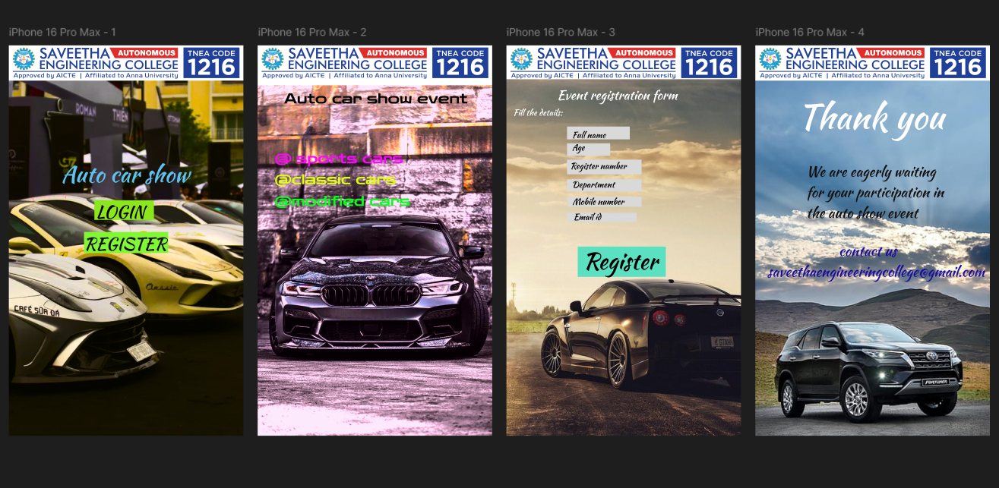

# Ex09 Event Registration Web Application
## Date:

## AIM:
To design, develop and deploy a web application for event registration.

## DESIGN STEPS:

### Step 1:
Create a new frame.

### Step 2:
Select any one preset size of your choice.

### Step 3:
Select the shapes you need.

### Step 4:
Import images as needed.

### Step 5:
Create pages based on your need and link them.

### Step 6:

Validate the HTML and CSS code.

### Step 6:

Publish the website in the given URL.

## DESIGN TOOL:
Figma

## CODE:

```
<div class="container--0-">
  <svg
    width="167"
    height="55"
    viewBox="0 0 167 55"
    fill="none"
    xmlns="http://www.w3.org/2000/svg"
  >
    <rect width="167" height="55" fill="#8BE61B"></rect>
  </svg>
  <div class="text-0-1-3">LOGIN</div>
  <div class="text-0-1-4">Auto car show</div>
  <svg
    width="236"
    height="59"
    viewBox="0 0 236 59"
    fill="none"
    xmlns="http://www.w3.org/2000/svg"
  >
    <rect width="236" height="59" fill="#81F633"></rect>
  </svg>
  <div class="text-0-1-7">REGISTER</div>
</div>
```

```
<div class="container--0-">
  
  <div class="text-0-1-2">Auto car show event</div>
  <div class="text-0-1-3">@ sports cars</div>
  <div class="text-0-1-4">@classic cars</div>
  <div class="text-0-1-5">@modified cars</div>
</div>
```

```
<div class="container--0-">
  
  <div class="text-0-1-2">Event registration form</div>
  <div class="text-0-1-3">Fill the details:</div>
  <svg
    width="176"
    height="36"
    viewBox="0 0 176 36"
    fill="none"
    xmlns="http://www.w3.org/2000/svg"
  >
    <rect width="176" height="36" fill="#D9D9D9"></rect>
  </svg>
  <div class="text-0-1-5">Full name</div>
  <svg
    width="121"
    height="35"
    viewBox="0 0 121 35"
    fill="none"
    xmlns="http://www.w3.org/2000/svg"
  >
    <rect width="121" height="35" fill="#D9D9D9"></rect>
  </svg>
  <div class="text-0-1-7">Age</div>
  <svg
    width="209"
    height="41"
    viewBox="0 0 209 41"
    fill="none"
    xmlns="http://www.w3.org/2000/svg"
  >
    <rect width="209" height="41" fill="#D9D9D9"></rect>
  </svg>
  <div class="text-0-1-9">Register number</div>
  <svg
    width="209"
    height="34"
    viewBox="0 0 209 34"
    fill="none"
    xmlns="http://www.w3.org/2000/svg"
  >
    <rect width="209" height="34" fill="#D9D9D9"></rect>
  </svg>
  <div class="text-0-1-11">Department</div>
  <svg
    width="207"
    height="28"
    viewBox="0 0 207 28"
    fill="none"
    xmlns="http://www.w3.org/2000/svg"
  >
    <rect width="207" height="28" fill="#D9D9D9"></rect>
  </svg>
  <div class="text-0-1-13">Mobile number</div>
  <svg
    width="195"
    height="26"
    viewBox="0 0 195 26"
    fill="none"
    xmlns="http://www.w3.org/2000/svg"
  >
    <rect width="195" height="26" fill="#D9D9D9"></rect>
  </svg>
  <div class="text-0-1-15">Email id</div>
  <svg
    width="247"
    height="85"
    viewBox="0 0 247 85"
    fill="none"
    xmlns="http://www.w3.org/2000/svg"
  >
    <rect width="247" height="85" fill="#5BE0C1"></rect>
  </svg>
  <div class="text-0-1-17">Register</div>
</div>
```

```
<div class="container--0-">
  
  <div class="text-0-1-2">Thank you</div>
  <div class="text-0-1-3">
    We are eagerly waiting for your participation in the auto show event
  </div>
  <div class="text-0-1-4">
    contact us<br />
    saveethaengineeringcollege@gmail.com
  </div>
</div>
```

## OUTPUT:



## RESULT:
The program to design, develop and deploy a web application for event registration is completed successfully.
